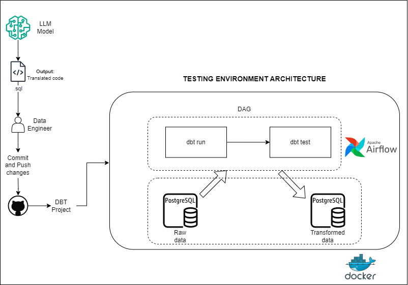

# Caixa Bank - LLM Translator

## dbt-airflow Testing Environment

This environment is designed to test a Large Language Model (LLM) that translates Oracle Data Integrator (ODI) pipeline transformations from XML files to dbt, using Apache Airflow to schedule the pipelines and test transformations.

### Airflow Deployment Using Containers

Airflow is deployed using Docker containers, leveraging a Docker Compose setup. This approach allows for scalable and reproducible deployment of Airflow with the CeleryExecutor. The docker-compose.yml file in this project contains several service definitions:

- airflow-scheduler - The scheduler monitors all tasks and DAGs, then triggers the task instances once their dependencies are complete.

- airflow-webserver - The webserver is available at http://localhost:8080.

- airflow-worker - The worker that executes the tasks given by the scheduler.

- airflow-triggerer - The triggerer runs an event loop for deferrable tasks.

- airflow-init - The initialization service.

- postgres - The database.

- redis - The redis - broker that forwards messages from scheduler to worker.

Some directories in the container are mounted, which means that their contents are synchronized between your computer and the container.

./dags - you can put your DAG files here.

./logs - contains logs from task execution and scheduler.

./config - you can add custom log parser or add airflow_local_settings.py to configure cluster policy.

./plugins - you can put your custom plugins here.

This file uses a customized Airflow image `(apache/airflow:2.9.2)`. If you need to install a new Python library or system library, you can add it to the custom image.

Initializing E
### Dockerfile (customized Airflow image)

The Dockerfile is based on the `apache/airflow:2.9.2` image and includes necessary dependencies and configurations. It sets up the environment for running dbt and integrates with other services like PostgreSQL and Redis.

#### Setting the right Airflow user
On Linux, the quick-start needs to know your host user id and needs to have group id set to 0. Otherwise the files created in dags, logs and plugins will be created with root user ownership. You have to make sure to configure them for the docker-compose:
```bash
mkdir -p ./dags ./logs ./plugins ./config
echo -e "AIRFLOW_UID=$(id -u)" > .env
```



### Main Components

1. **dbt-airflow**:

A Python package that assists Data and Analytics engineers in rendering dbt projects within Apache Airflow Directed Acyclic Graphs (DAGs). This integration ensures that models, seeds, snapshots, and tests are represented by individual Airflow tasks, providing a seamless workflow for managing data transformations and orchestration. `dbt-airflow` is a package that builds a layer in-between Apache Airflow and dbt, and enables teams to automatically render their dbt projects in a granular level such that they have full control to individual dbt resource types. Every dbt model, seed, snapshot or test will have its own Airflow Task so that you can perform any action at a task-level. 

1.1. **Features**:

- Render a `dbt` project as a `TaskGroup` consisting of Airflow Tasks that correspond to dbt models, seeds, snapshots
and tests
- Every `model`, `seed` and `snapshot` resource that has at least a single test, will also have a corresponding
test task as a downstream task
- Add tasks before or after the whole dbt project
- Introduce extra tasks within the dbt project tasks and specify any downstream or upstream dependencies
- Create sub-`TaskGroup`s of dbt Airflow tasks based on your project's folder structure 

1.2. **How does it work**:

The library essentially builds on top of the metadata generated by `dbt-core` and are stored in 
the `target/manifest.json` file in your dbt project directory. This means that you first need to compile (or run 
any other dbt command that creates the `manifest` file) before creating your Airflow DAG. This means the `dbt-airflow` 
package expects that you have already compiled your dbt project so that an up to date manifest file can then be used
to render the individual tasks.

1.3. **Installation**:

The package is available on PyPI and can be installed through `pip`:
```bash
pip install dbt-airflow
```


2. **dbt**:
    - dbt (data build tool) is a command-line tool that enables data teams to build, maintain, and test data models in a scalable manner. The primary challenge is integrating `dbt` into modern data workflows and infrastructure. While dbt CLI is a powerful tool, its isolated use can create silos in data management within an organization. Shared visibility and collaborative management of data models are essential for effective data operations.

    `dbt` needs to connect to your target environment (database, warehouse etc.) and in order to do so, it makes use of 
    different adapters, each dedicated to a different technology (such as Postgres or BigQuery). Therefore, before running
    `dbt-airflow` you also need to ensure that the required adapter(s) are installed in your environment. 

    For the full list of available adapters please refer to the official 
    [dbt documentation](https://docs.getdbt.com/docs/available-adapters). 


3. **Apache Airflow**:
    - An open-source tool to programmatically author, schedule, and monitor workflows. Airflow’s DAGs (Directed Acyclic Graphs) allow for the scheduling and orchestration of dbt tasks, providing a robust environment for managing and monitoring data pipelines.

### dbt Project Structure

A typical dbt project integrated with Airflow will have the following structure:

```plaintext
example_dbt_project/
│
├── models/
│   ├── example/
│   │   ├── my_first_dbt_model.sql
│   │   ├── my_second_dbt_model.sql
│   │   └── ...
│   └── ...
├── snapshots/
│   ├── example/
│   │   ├── my_first_snapshot.sql
│   │   └── ...
│   └── ...
├── seeds/
│   ├── example/
│   │   ├── my_first_seed.csv
│   │   └── ...
│   └── ...
├── tests/
│   ├── example/
│   │   ├── my_first_test.sql
│   │   └── ...
│   └── ...
├── macros/
│   └── ...
├── dbt_project.yml
├── profiles.yml
```


### Main Components of dbt Project

1. **models/**:
    - Contains SQL files defining the transformations to be applied to the raw data. Each SQL file represents a dbt model.

2. **snapshots/**:
    - Contains SQL files that capture the state of source data at specific points in time. Useful for tracking slowly changing dimensions.

3. **seeds/**:
    - Contains CSV files with static data that can be loaded into your database. Useful for reference data or small lookup tables.

4. **tests/**:
    - Contains SQL files for testing data models. Tests ensure data quality and consistency.

5. **macros/**:
    - Contains reusable SQL snippets that can be used across multiple models. Macros help in writing DRY (Don't Repeat Yourself) SQL code.

6. **dbt_project.yml**:
    - The configuration file for the dbt project. It defines the project’s settings, including model paths, source paths, and configurations for different environments.

    ```yaml
    name: 'my_dbt_project'
    version: '1.0.0'
    config-version: 2

    profile: 'my_dbt_profile'

    target-path: "target"
    clean-targets:
      - "target"
      - "dbt_modules"

    models:
      my_dbt_project:
        example:
          materialized: view
    ```

7. **profiles.yml**:
    - The configuration file for connection settings to the database. It includes information about different environments (e.g., development, production).

    ```yaml
    my_dbt_profile:
      target: dev
      outputs:
        dev:
          type: postgres
          host: localhost
          user: my_user
          password: my_password
          dbname: my_database
          schema: public
    ```

### Airflow DAG Integration

An Airflow DAG that builds and tests data models will typically consist of two primary tasks:

1. **dbt run**:
    - Executes the `dbt run` command to build the data models.

2. **dbt test**:
    - Executes the `dbt test` command to validate the data models.

Example DAG structure:

```python
from airflow import DAG
from airflow.operators.bash_operator import BashOperator
from datetime import datetime

default_args = {
    'owner': 'airflow',
    'start_date': datetime(2023, 1, 1),
    'retries': 1,
}

with DAG('dbt_workflow', default_args=default_args, schedule_interval='@daily') as dag:

    dbt_run = BashOperator(
        task_id='dbt_run',
        bash_command='cd /path/to/your/dbt_project && dbt run'
    )

    dbt_test = BashOperator(
        task_id='dbt_test',
        bash_command='cd /path/to/your/dbt_project && dbt test'
    )

    dbt_run >> dbt_test
```